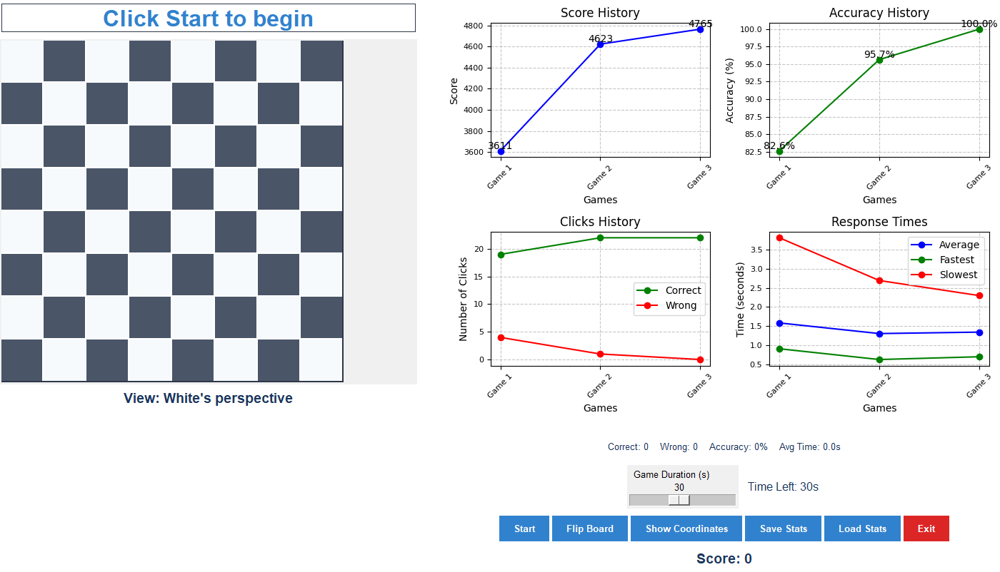

# Chess Coordinates Trainer

A dynamic, interactive application designed to help chess players master board coordinates through an engaging practice interface. This trainer combines intuitive gameplay with comprehensive statistical tracking to enhance learning and monitor progress.



## 🎯 Features

- **Interactive Chessboard**
  - Dynamic 8x8 grid with standard chess coordinates
  - Supports both White and Black perspectives
  - Toggle coordinate visibility for learning assistance
  - Clean, modern UI with customizable color scheme

- **Training Mode**
  - Configurable practice sessions (5-60 seconds)
  - Random coordinate generation
  - Real-time feedback on moves
  - Response time tracking
  - Accuracy monitoring

- **Comprehensive Statistics**
  - Real-time performance metrics
  - Score tracking with multi-factor calculation
    - Base points for correct clicks
    - Accuracy bonuses
    - Speed bonuses
    - Penalties for mistakes
  - Visual performance graphs
    - Score history
    - Accuracy trends
    - Click distribution
    - Response time analysis

- **Data Management**
  - Save training statistics to JSON
  - Load previous training data
  - Historical performance tracking

## 🚀 Getting Started

### Prerequisites
- Python 3.x
- Required packages:
  ```
  tkinter
  matplotlib
  ```

### Installation
1. Clone this repository
2. Install required dependencies:
   ```bash
   pip install matplotlib
   ```
   Note: tkinter usually comes with Python installation

### Running the Application
```bash
python chess_coordinates_game.py
```

## 🎮 How to Play

1. **Start a Session**
   - Use the slider to set your preferred practice duration (5-60 seconds)
   - Click "Start" to begin
   - A random coordinate will appear above the board

2. **During Practice**
   - Click the corresponding square on the board
   - Correct moves: Generate new coordinates
   - Incorrect moves: Counted as mistakes
   - Response times are tracked for performance analysis

3. **Game Controls**
   - "Flip Board": Switch between White and Black perspectives
   - "Show Coordinates": Toggle coordinate visibility
   - "Save Stats": Export your progress
   - "Load Stats": Review previous sessions

## 📊 Scoring System

The application uses a sophisticated scoring system that considers multiple factors:

- Base score: 100 points per correct click
- Accuracy bonus: Up to 100% of base score
- Speed bonus: Up to 500 points based on response time
- Penalties: -50 points per incorrect click

## 🎨 Customization

The interface uses a modern color scheme defined in the `COLORS` dictionary:
```python
COLORS = {
    'primary': '#1a365d',     # Dark blue
    'secondary': '#2d3748',   # Dark gray
    'white_square': '#f7fafc', # Light gray-white
    'black_square': '#4a5568', # Medium gray
    'accent': '#3182ce',      # Bright blue
    'text': '#2d3748',        # Dark gray
    'background': '#ffffff'   # White
}
```

## 🛠 Technical Details

### Architecture
- Built using Python's tkinter for GUI
- Matplotlib integration for statistical visualization
- Object-oriented design with clear separation of concerns
- Event-driven architecture for user interactions

### Key Components
- `ChessCoordinatesGame`: Main game class
- Real-time statistics tracking
- JSON-based data persistence
- Dynamic graph updates
- Responsive UI elements

## 📈 Performance Tracking

The application tracks several metrics:
- Correct/wrong moves
- Response times (average, fastest, slowest)
- Accuracy percentages
- Historical performance trends

## 🤝 Contributing

Contributions are welcome! Some areas for potential enhancement:
- Additional practice modes
- Sound effects
- Network play capabilities
- Additional statistical analyses
- Custom theme support

## 📝 License

This project is available for free use and modification. Attribution is appreciated but not required.

## ✨ Acknowledgments

Created to help chess players improve their board awareness and coordinate recognition skills.
